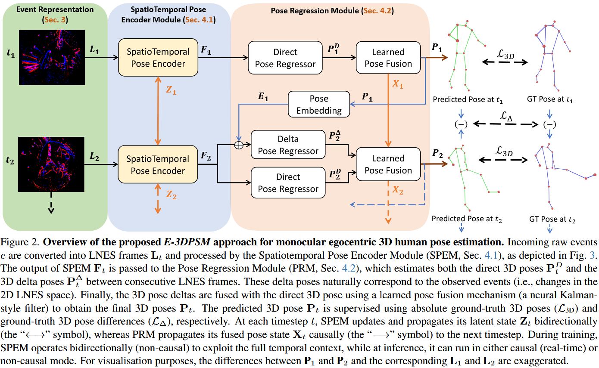
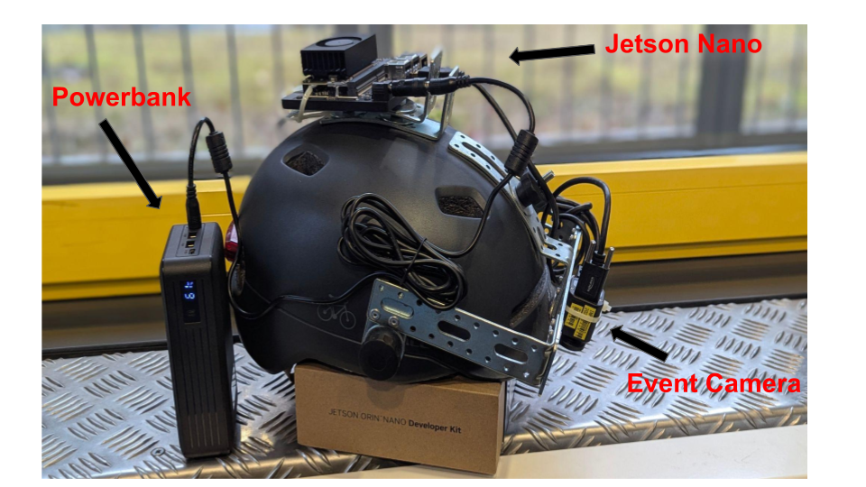
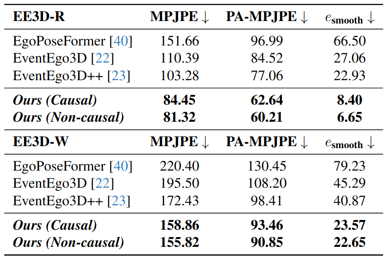

# E-3DPSM: A State Machine for Event-based Egocentric 3D Human Pose Estimation

<p align="center">
  <strong>Mayur Deshmukh</strong><sup>1,2</sup> &nbsp;
  <strong>Hiroyasu Akada</strong><sup>1</sup> &nbsp;
  <strong>Helge Rhodin</strong><sup>1,3</sup> &nbsp;
  <strong>Christian Theobalt</strong><sup>1</sup> &nbsp;
  <strong>Vladislav Golyanik</strong><sup>1</sup>
</p>

<p align="center">
  <sup>1</sup> Max Planck Institute for Informatics, SIC &nbsp;
  <sup>2</sup> Saarland University &nbsp;
  <sup>3</sup> Bielefeld University
</p>

<p align="center">
  <strong>CVPR 2026</strong>
</p>

<p align="center">
  <a href="https://arxiv.org/abs/2604.08543">Paper</a> |
  <a href="https://www.youtube.com/watch?v=bCfHkJylC68">Video</a> |
  <a href="https://4dqv.mpi-inf.mpg.de/E-3DPSM/">Project Page</a>
</p>

<p align="center">
  
</p>

<p align="center">
  <strong>Rethinking event-based egocentric 3D human pose estimation.</strong>
  E-3DPSM models motion as a continuous event-driven state evolution, fusing delta and direct 3D pose updates to achieve real-time and temporally stable 3D reconstruction.
</p>

## Abstract

Event cameras offer multiple advantages in monocular egocentric 3D human pose estimation from head-mounted devices, such as millisecond temporal resolution, high dynamic range, and negligible motion blur. Existing methods effectively leverage these properties, but suffer from low 3D estimation accuracy that remains insufficient for applications such as immersive VR/AR. This is due to designs not being fully tailored to event streams and their asynchronous, continuous nature, leading to high sensitivity to self-occlusions and temporal jitter. E-3DPSM rethinks this setting with an event-driven continuous pose state machine for event-based egocentric 3D human pose estimation. It aligns continuous human motion with fine-grained event dynamics, evolves latent states, and predicts continuous 3D joint updates that are fused with direct 3D pose predictions, producing stable and drift-free reconstructions. E-3DPSM runs in real time at 80 Hz on a single workstation and sets a new state of the art on two benchmarks, improving MPJPE by up to 19% and temporal stability by up to 2.7x.

## Method

<p align="center">
  
</p>

## Hardware Setup

<p align="center">
  
</p>

The head-mounted device uses a single fisheye egocentric event camera for input, an NVIDIA Jetson Orin Nano for onboard processing, and a portable power source for standalone operation.

## Quantitative Results

<p align="center">
  
</p>

E-3DPSM improves both 3D pose accuracy and temporal stability compared with prior event-based egocentric pose estimation methods.

## Repository Structure

- `run.py`: Lightning CLI entrypoint for training, validation, and testing
- `configs/`: experiment configurations for pretraining, finetuning, and evaluation
- `EventEgoPoseEstimation/`: core model, dataset, loss, and training code
- `scripts/`: Slurm shell scripts
- `images/`: README and project assets

## Setup

Create the conda environment:

```bash
conda env create -f environment.yml
conda activate e3dpsm
```

Install `ocam` support if it is not already available in your environment:

```bash
pip install git+https://github.com/Chris10M/ocam_python.git
```

## Training and Evaluation

This repository uses `pytorch_lightning` via `LightningCLI`, so experiments are launched through `run.py` with a config file.

Example training:

```bash
python run.py fit --config configs/pretrain_deform_attention_kf_lnes.yaml
```

Example finetuning:

```bash
python run.py fit --config configs/finetune_deform_attention_kf_lnes.yaml
```

Example evaluation:

```bash
python run.py test --config configs/evaluate_deform_attention_kf_lnes.yaml
```

Please update dataset paths, checkpoint paths, and runtime settings inside the selected config before launching an experiment.

## Citation

If you find this repository useful, please cite:

```bibtex
@inproceedings{deshmukh2026e3dpsm,
  title = {E-3DPSM: A State Machine for Event-based Egocentric 3D Human Pose Estimation},
  author = {Deshmukh, Mayur and Akada, Hiroyasu and Rhodin, Helge and Theobalt, Christian and Golyanik, Vladislav},
  booktitle = {Computer Vision and Pattern Recognition (CVPR)},
  year = {2026}
}
```

## Acknowledgments

This codebase borrows dataloaders from [EventEgo3D++](https://github.com/Chris10M/EventEgo3D_plus_plus).

## License

This project is released under the license provided in [LICENSE](LICENSE).
